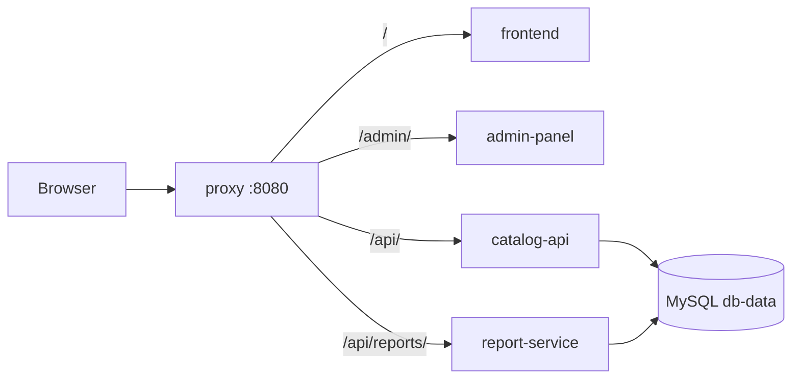

# EventHub - School Event Registration

Containerized event registration system with Jenkins CI/CD (SYSIN final project).
Students browse school events (conferences, seminars, workshops), register through a short form, and get notified when approved. The admin manages events, approves/rejects registrations, and views reports.

## Modules (each in its own container)
| Container | Tech | Role |
|---|---|---|
| proxy | Nginx 1.27 | Single public entry point (port 8080) |
| frontend | Vanilla JS/HTML/CSS on Nginx | Event cards, register form, login/sign up, My Event Registrations, dark mode, notifications |
| catalog-api | Node.js 20 (no framework) | Events CRUD, auth, registrations, approval logic, notifications |
| report-service | Node.js 20 | `GET /reports/summary` (admin only) |
| admin-panel | Vanilla JS/HTML/CSS on Nginx | Dashboard + report, event CRUD, approve/reject, notifications |
| db | MySQL 8.4 | Named volume `db-data`, not published |



## Run locally
```bash
cp .env.example .env      # edit the passwords
docker compose up -d --build
```
Open http://localhost:8080. Admin login uses `ADMIN_EMAIL` / `ADMIN_PASSWORD` from `.env` (created automatically on first start). Admins land on `/admin/`.

## Jenkins
1. `cd infra/jenkins && docker compose up -d --build` -> http://localhost:8081 (see the project guidelines, Phase 4).
2. Add credential: **Secret file**, id `eventhub-env`, containing your real `.env`.
3. New Item -> Pipeline -> *Pipeline script from SCM* -> GitHub repo URL, branch, Script Path `Jenkinsfile`.
4. Trigger: `pollSCM('H/2 * * * *')` is set in the Jenkinsfile. Run the job once manually so Jenkins registers the trigger.

Pipeline: Checkout -> Test -> Build Images -> Deploy -> Smoke Test. Tests run via `docker build --target test` (Node's built-in `node:test`; no Selenium).

## Rollback
```bash
TAG=<previous build number> docker compose -p eventhub up -d --no-build
```

## Tests
`cd catalog-api && npm test` and `cd report-service && npm test` (pure unit tests, no database needed).

## Team
_Fill in members and roles._
